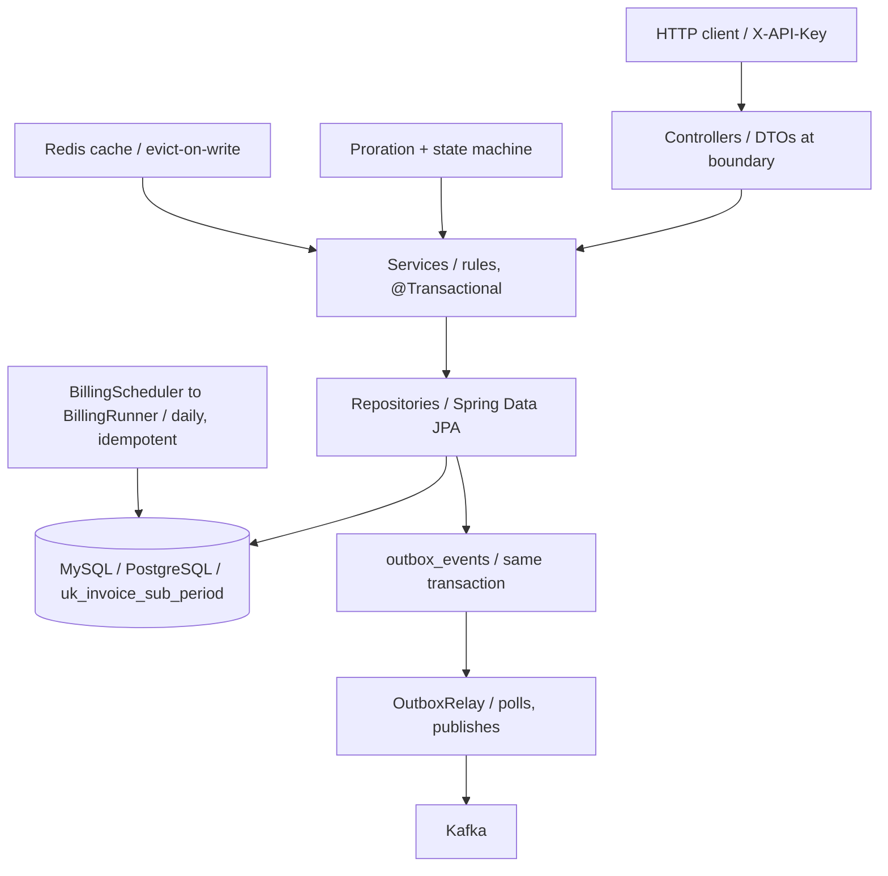

[README-4.md](https://github.com/user-attachments/files/31439061/README-4.md)

  

Full-Stack Engineering, Backend Systems & Applied AI Tooling

React/TypeScript frontends • Correctness-focused backend services • AI-assisted developer tooling

I build full-stack products end to end — React/TypeScript frontends backed by Spring Boot services — with a particular focus on getting the backend right: idempotent writes, transactional integrity, and explicit state machines instead of implicit status flags. That's paired with a Python + LLM-powered code-review tool that automates a task I'd otherwise do by hand.

---

## Featured Projects

| Project | What it does | Tech | Link |
|---|---|---|---|
|  **MiniBee** | Subscription billing microservice — idempotent invoicing proven safe under concurrency via a DB-level constraint, plus a transactional outbox for events | Java · Spring Boot · PostgreSQL · Redis · Kafka | _add link_ |
| **CodeSheriff** | LLM-powered GitHub PR reviewer with inline diff comments, async queue, and a feedback loop | Python · FastAPI · Gemini API | [Repo](https://github.com/SrijaMalhar/codesheriff) |
| **Supply Chain Parts Dashboard** | Tracks parts from supplier to deployment with optimistic UI, audit logs, and inventory valuation | React · Vite · Spring Boot | [Live Demo](https://srijamalhar.github.io/supply-chain-dashboard/) |
| **Predictive Warranty Claim Engine** | Rules-based warranty risk validation with a stateless preview endpoint separate from submission | Java · Spring Boot · React | _add link_ |

<b>MiniBee — architecture diagram</b>

---

## Tech Stack

| Category | Technologies |
|---|---|
| **Languages** |     |
| **Backend** |     |
| **Frontend** |    |
| **Databases** |     |
| **Infra / Messaging** |    |
| **AI / Tooling** |  |
| **Testing** |   |

**What's actually used where**

| Technology | Used in |
|---|---|
| Java / Spring Boot | MiniBee, Supply Chain Dashboard, Predictive Warranty Engine |
| React / TypeScript | Supply Chain Dashboard, Predictive Warranty Engine (frontend) |
| Kafka + Redis | MiniBee |
| Docker / Docker Compose | MiniBee, Supply Chain Dashboard |
| Python + Gemini API | CodeSheriff |

---

## GitHub Stats

  
  

## Let's Connect

  
  

